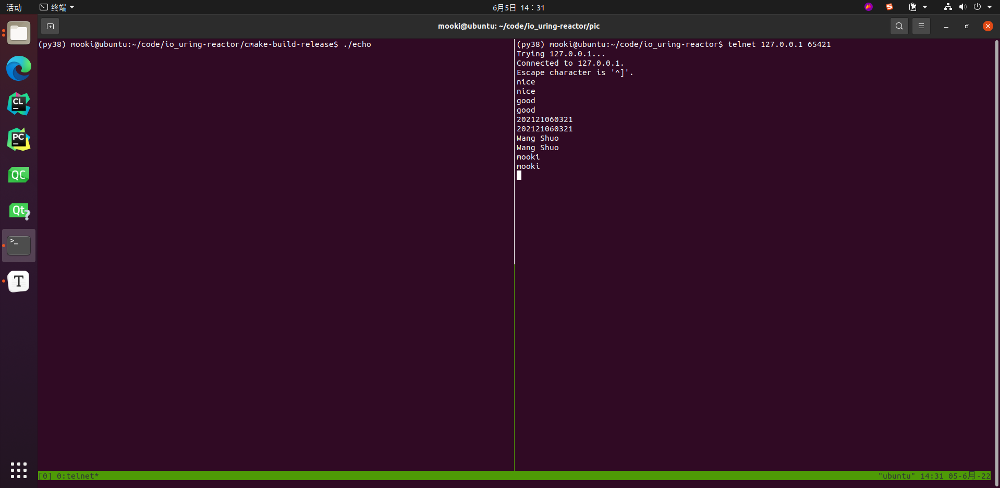
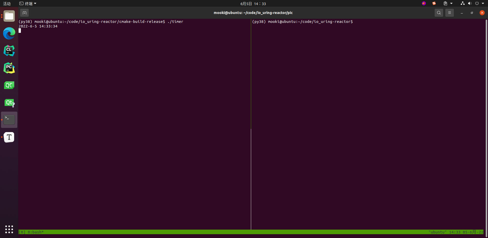

# io_uring Reactor

## 1 整体设计

首先，需要明确的一点是io_uring是异步IO模型，这在编程中和同步IO模型是很不一样的。前者中，操作系统（或者说内核）向程序通知的是存在IO事件待处理，而具体的IO操作仍需要用户通过read()、write()等系统调用或库函数完成，后者中，操作系统向程序通知的是IO事件已完成，此时目标数据已经读入到/写出自提前指定好的缓冲区，程序接下来只需要执行后续业务逻辑处理即可。

## 1.1 主要数据结构

class EventLoop：实现事件驱动的基础，负责收割事件

class TcpServer：用于编写服务器程序，管理Acceptor、TcpConnection

class Acceptor：用于建立新连接，管理监听套接字对应的Channel

class TcpConnection：管理已有连接，管理连接套接字对应的Channel

class Channel：管理fd（包括监听套接字、连接套接字）

struct ConnInfo：在io_uring事件提交和接收过程期间传递信息

## 1.2 主要逻辑

### 1.2.1 收割事件 - 相当于epoll中的poll操作

从io_uring_wait()获得返回的struct io_uring_cqe * -> 判断已完成事件的类型 -> 调用对应事件处理函数进行处理

* 事件处理函数已经提前设置好，如读回调、写回调、自定义回调等

### 1.2.2 socket特有

#### 开启监听

创建（socket()）并命名（bind()）监听套接字 -> 开始监听（listen()） -> **通过io_uring_prep_accept()使内核接管监听套接字**  -> **等待io_uring_wait()返回，即存在新连接等待处理**

#### 建立新连接

从io_uring_wait()返回的struct io_uring_cqe *中获取新的连接套接字fd -> **通过io_uring_prep_send()使内核接管连接套接字** -> **等待io_uring_wait()返回，即已经有数据被读入到缓冲区中等待处理**

### 1.2.3 timer特有

#### 建立新超时事件

设置struct __kernel_timespec格式的超时事件 -> **通过io_uring_prep_timeout()使内核接管超时事件** -> **等待io_uring_wait()返回，即已经有数据被读入到缓冲区中等待处理**

## 2 Channel实验方案

### 2.1 socket

> echo.cpp核心代码见附录部分或./echo.cpp



### 2.2 timer

> timer.cpp核心代码见附录部分或./timer.cpp
>
> * 说明：本实验失败，程序并未在指定超时时间结束后执行回调函数，推测应该是我对io_uring_prep_timeout()中使用的struct __kernel_timespec和需要设置的flags理解有误



## 3 性能测试

### 3.1 测试环境

> 测试在虚拟机下进行

CPU：Intel Core i5 8300H

内存：8GB 2667Mhz

硬盘：浦科特M9PeG 512GB

操作系统：Ubuntu 20.04.4

Linux内核版本：5.13.0

liburing版本：2022年5月25日clone自[Github上axboe的liburing代码仓库](https://github.com/axboe/liburing)

### 3.2 测试结果

> 性能测试程序：[GitHub上haraldh的rust_echo_bench代码仓库](https://github.com/haraldh/rust_echo_bench)
>
> 单位：request/sec
>
> 详细测试log位于：./benchmark

#### 结果1 - 使用io_uring且实现遵循Reactor架构的echo服务器（自己编写）

> ./echo.cpp
>
> * 程序中的void onConnection()是注册到每个class TcpConnection实例上的连接事件回调函数，在每次连接建立、销毁时被调用（一般是输出相关信息），为了防止额外IO操作对测试结果产生影响，测试时此函数函数体为空
> * 测试过程中服务器偶尔会出现性能大幅度下降，原因不明

| bytes\clients | 1     | 50    | 150   | 300   | 500   | 1000  |
| ------------- | ----- | ----- | ----- | ----- | ----- | ----- |
| 128 bytes     | 13117 | 43832 | 40941 | 37453 | 33749 | 31232 |
| 512 bytes     | 12856 | 42195 | 40683 | 36248 | 33586 | 30099 |
| 1000 bytes    | 12821 | 42650 | 39539 | 34777 | 33476 | 30470 |

#### 结果2-  使用io_uring的裸echo服务器

> 对比项1，使用参考资料3

| bytes\clients | 1     | 50    | 150   | 300   | 500   | 1000  |
| ------------- | ----- | ----- | ----- | ----- | ----- | ----- |
| 128 bytes     | 13413 | 46096 | 45784 | 44423 | 42771 | 40945 |
| 512 bytes     | 12502 | 42602 | 46613 | 44911 | 44378 | 44076 |
| 1000 bytes    | 13645 | 47479 | 48653 | 43669 | 41855 | 43587 |

#### 结果3 - 基于epoll的裸echo服务器

> 对比项2，使用[GitHub上frevib的epoll-echo-server代码仓库](https://github.com/frevib/epoll-echo-server)

| bytes\clients | 1     | 50    | 150   | 300   | 500   | 1000  |
| ------------- | ----- | ----- | ----- | ----- | ----- | ----- |
| 128 bytes     | 12862 | 46930 | 45802 | 43954 | 42714 | 42432 |
| 512 bytes     | 12856 | 46659 | 44349 | 42123 | 41532 | 41829 |
| 1000 bytes    | 13122 | 46911 | 44302 | 42601 | 41809 | 42214 |

#### 3.3 结果分析

1. 从结果1和结果2对比可以看出，我自己实现的使用io_uring且遵循Reactor架构实现的echo服务器和只使用了io_uring的裸echo服务器性能相比更弱
   * 这可能跟为了遵循Reactor架构而衍生出的很多不必要调用有关
2. 从结果2和结果3对比可以看出，使用io_uring的裸echo服务器和使用epoll的裸echo服务器性能相比几乎相同
   * 理论上来讲，io_uring性能应该更强，现在这个结果可能跟当前对io_uring的使用并没有开启feat fast poll模式有关

## 4参考资料

1. [GitHub上chenshuo的muduo代码仓库](https://github.com/chenshuo/muduo)
2. [GitHub上chenshuo的recipes代码仓库](https://github.com/chenshuo/recipes)
3. [GitHub上frevib的io_uring-echo-server代码仓库](https://github.com/chenshuo/recipes)
4. [长文梳理Muduo库核心代码及优秀编程细节剖析](https://blog.csdn.net/T_Solotov/article/details/124044175?spm=1001.2014.3001.5506)
5. [AIO 的新归宿：io_uring](https://zhuanlan.zhihu.com/p/62682475)
6. [浅析开源项目之io_uring](https://zhuanlan.zhihu.com/p/361955546)
7. [Lord of the io_uring](https://unixism.net/loti/)
8. [Efficient IO with io_uring](https://kernel.dk/io_uring.pdf)

## 5 TODO

1. 加入多线程支持，借鉴muduo实现one loop per thread
2. 当前是全局缓存方案，要改成类似muduo中的缓存方案
3. 当前不支持同时存在多个定时器，加入对TimerQueue的支持
4. 断开连接处理逻辑不完整
5. 添加对io_uring的feast fast poll支持

## 6 附录

1. echo.cpp核心代码

   ```c++
   void onConnection(const TcpConnectionPtr& conn)
   {
       // 什么也不做
   }
   
   void onMessage(const TcpConnectionPtr& conn, char *buf, int size)
   {
       conn->send(buf, size);
   }
   
   int main()
   {
       uint16_t port = 65421;
       EventLoop loop;
   
       TcpServer server(&loop, port);
       server.setConnectionCallback(onConnection);
       server.setMessageCallback(onMessage);
       server.start();
   
       loop.loop();
   }
   ```

2. timer.cpp核心代码

   ```c++
   void printCurrentTime()
   {
       time_t nowTime;
       struct tm *nowLocalTime;
       nowTime = time(nullptr);
       nowLocalTime = localtime(&nowTime);
       printf("%d-%d-%d %d:%d:%d\n",
              nowLocalTime->tm_year + 1900, nowLocalTime->tm_mon + 1, nowLocalTime->tm_mday,
              nowLocalTime->tm_hour, nowLocalTime->tm_min, nowLocalTime->tm_sec);
   }
   
   int main()
   {
       EventLoop loop;
   
       Timer timer(&loop);
       printCurrentTime();
       timer.runAfter(3.5, printCurrentTime);
   
       loop.loop();
   }
   ```

   
